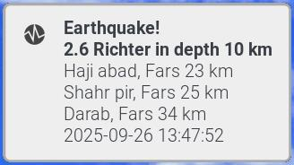
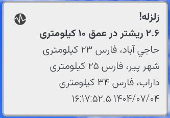

# zlarz
A simple bash client for [http://irsc.ut.ac.ir](http://irsc.ut.ac.ir) to fetch
latest Iranian seismic events for a list of provinces or those above a minimum
magnitude.

<p align="middle">
  
  
</p>


## Dependencies
- `curl jq fq notify-send`
- `xmlstarlet` : (legacy)

In a Debian-like distro, these can be installed with:

``` shell
sudo apt install curl jq libnotify-bin fq xmlstarlet
```

## Usage
Check `zlarz -h`:

```console
Usage: zlarz [-p provinces] [-m min_magnitude] [-l language]
             [-k max_events] [-o output_file]
             [-n] [-c] [-e] [-x] [-V] [-h]
DESCRIPTION
    zlarz: query for latest earthquake events in Iran, apply filters
    and present the results

OPTIONS
     [-p provinces]
        Provinces of interest at which the event occured (with any magnitude)
        Format: comma-separated list, e.g. "Gilan, Ghazvin"
     [-m min_magnitude]
        Minimum magnitude of the event in Richter scale (in any province)
        Range: m[float] >= 0
     [-l language]
        Language of output
        Available: "en", "fa"
     [-k max_events]
        Maximum number of matching events
        Range: m[int] >= 0
     [-n]
        Enable presentation as notification (via notify-send)
     [-o output_file]
        Path of output file to save raw json feed e.g. /tmp/latest_feed.json
        WARNING: output_file would get mutated!
     [-c]
        Only process events that are not already in the cache file, then update
        the cache file
     [-e]
        Returns with exit code 3 if there are no matching events
        Note: This mode is useful for caller scripts
     [-x]
        Legacy mode, use xmlstarlet instead of fq and jq
        Note: In this mode, only -k switch has an effect
     [-V]
        Display the script version
     [-h]
        Display the help message


NOTES
    - -p and -m switches are applied independently, then ORed. So -p "Gilan" -m
      5 would get all events in Gilan (with any magnitude) + all events with
      mag>=5 (in any province). In other words, this script does NOT support
      getting for example >=5 Richter events only in Gilan.

EXAMPLES
    # get all events with >=0 magnitude (in any province)
    zlarz -m 0

    # get all events with magnitudes >= 3.7 (in any province), farsi language,
    # with notification
    zlarz -m 3.7 -l fa -n

    # get last 2 events in Gilan (with any magnitude) also save the unfiltered
    # feed to an output file
    zlarz -p "Gilan" -k 2 -o /tmp/feed.json

    # get all events in Gilan or Ghazvin or Zanjan (with any magnitude) PLUS all
    # events with magnitude >= 3.5 (in any province)
    zlarz -p "Gilan,Zanjan,Ghazvin" -m 3.5

    # get all NEW events that {occured in Gilan with any magnitude PLUS occured
    # anywhere with magnitude >=5 Richter}, update the cache file, use farsi,
    # use notification
    zlarz -p "Gilan" -m 5 -c -l fa -n

```

- The legacy xmlstarlet mode (`-x`) is only provided for old systems that don't
have a package for fq

## Integrations
- A [desktop file](contrib/earthquake-checker.desktop) is provided
- To continuously check for new seismic events, sample user-level systemd
  [service](contrib/earthquake-checker.service) and
  [timer](contrib/earthquake-checker.timer) files are provided. These call the
  [earthquake-checker](contrib/earthquake-checker) wrapper script. Modify target
  province list or minimum magnitude [Richter] as desired

## Development
- linter: `shellcheck`
- formatter: `shfmt -i 4 -bn -ci -sr`

